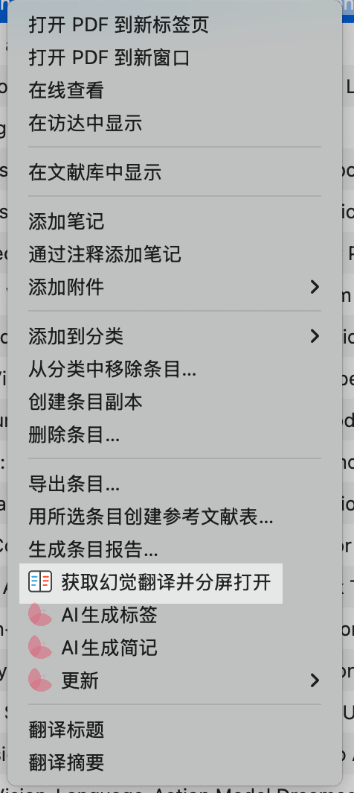
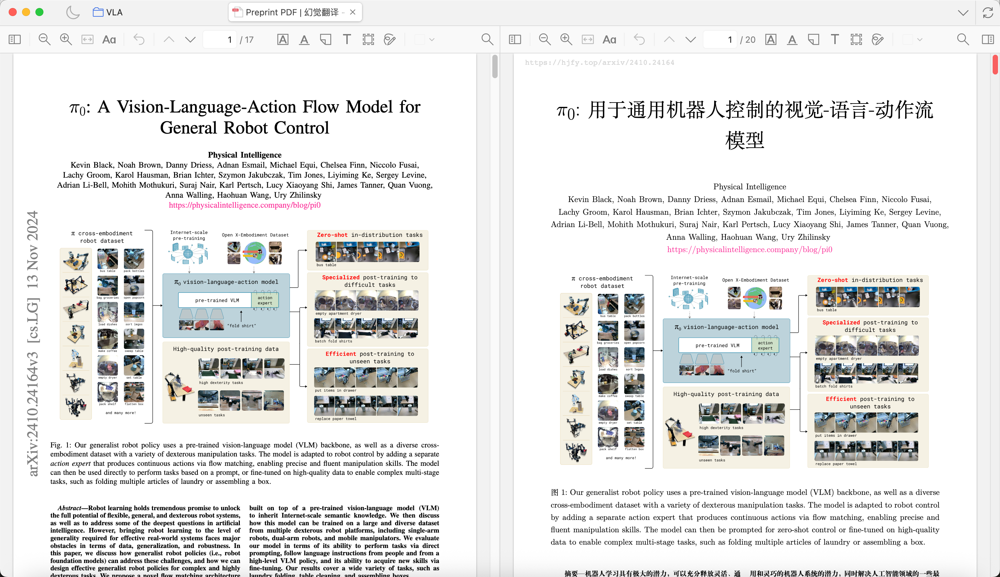

# HJFY Split Reader CN

[](https://www.zotero.org/)
[](LICENSE)
[](https://github.com/windingwind/zotero-plugin-template)

HJFY Split Reader CN 是一个 Zotero 8 / 9 插件，用来为 arXiv 论文获取 `hjfy.top` 上的中文翻译 PDF，并把原文 PDF 与译文 PDF 在 Zotero 阅读器里分屏打开。

这个仓库是基于 [Infinity4B/zotero-hjfy-split-reader](https://github.com/Infinity4B/zotero-hjfy-split-reader) 的改版。改版重点不只是自动补找 arXiv ID，也包括修复实际使用中容易导致“查不到、拉不下、一直卡住”的 HJFY 查询和下载链路：`arxivInfo` 接口失败或无响应时不再卡死，HJFY 状态轮询有明确进度提示，返回相对 PDF URL 时也能正常下载，下载成功后会把中文译文 PDF 挂回原 Zotero 论文条目。

## 主要功能

- 在 Zotero 条目和附件右键菜单中增加“获取幻觉翻译并分屏打开”。
- 优先复用同一条目下已经存在的 HJFY 中文译文附件。
- 查询 `hjfy.top`，如果已有译文 PDF，则自动下载并保存为当前条目的子附件。
- 下载完成后，自动把原文 PDF 与中文译文 PDF 在同一标签页中分屏打开。
- 默认以右侧译文窗格为主窗格，左侧原文跟随译文滚动。
- 保留分屏阅读器的交换左右窗格、滚动同步等能力。

## 本改版新增内容

- 支持从 Zotero 条目的 DOI、URL、Extra 字段中识别 arXiv ID。
- 支持从 PDF 附件标题、附件 URL、附件文件名中识别 arXiv ID。
- 当条目没有 arXiv 标识时，会按标题查询 arXiv，并使用严格标题匹配降低误判。
- arXiv 标题查询参考 Zotero 官方 `arXiv.org.js` translator 的网页搜索方式，而不是直接用容易触发限制的 `export.arxiv.org` 标题查询。
- 增加 OpenAlex works API 作为标题查询兜底，数据解析参考 Zotero 官方 OpenAlex translators。
- 自动写回 `Extra: arXiv: <id>`；如果条目没有 URL，会写入 arXiv URL；如果条目没有 DOI，会写入 arXiv DOI。插件不会覆盖已有正式 DOI。
- 对 `hjfy.top/api/arxivInfo` 增加超时和失败兜底，避免接口异常或不返回时整个流程卡死。
- 修复 HJFY 查询/下载链路中的多个失败点，减少“明明网页能下载，但插件拉不下来”的情况。
- 轮询 HJFY 翻译状态时显示进度窗口，让用户能看出插件仍在等待结果，而不是无反馈卡住。
- 支持 HJFY 返回相对路径 PDF URL 的情况，避免因为 URL 不是完整地址而下载失败。
- 下载成功后自动把中文译文 PDF 作为当前论文条目的附件保存，后续再次打开会优先复用本地译文附件。
- 对没有 arXiv 版本、标题匹配失败、HJFY 没有可下载译文等情况给出更明确的失败反馈。

## 界面预览

### 右键菜单入口

<p align="center">
  
</p>

### 分屏阅读效果

<p align="center">
  
</p>

## 安装

推荐安装 Release 里的 `.xpi`：

1. 打开本仓库的 Releases 页面。
2. 下载最新的 `hjfy-split-reader-cn.xpi`。
3. 在 Zotero 中打开 `工具` -> `插件`。
4. 点击右上角齿轮 -> `Install Plugin From File...`。
5. 选择下载的 `.xpi` 文件。

用户只需要安装 `.xpi`。插件自动更新所需的 `update.json` 托管在 GitHub Pages，不需要手动下载或安装。

如果仓库还没有发布 Release，也可以本地构建：

```bash
npm ci
npm run build
```

构建产物位于：

```text
.scaffold/build/hjfy-split-reader-cn.xpi
```

## 使用方式

1. 在 Zotero 中选中一篇论文条目，或选中这篇论文下的 PDF 附件。
2. 右键点击“获取幻觉翻译并分屏打开”。
3. 插件会依次执行：
   - 查找当前条目下是否已有中文译文附件。
   - 解析或按标题查询 arXiv ID。
   - 查询 `hjfy.top` 是否已有可下载译文。
   - 如果译文已生成，则下载 PDF 并挂到当前 Zotero 条目下。
   - 自动打开原文和译文的分屏阅读器。

如果 HJFY 还没有现成译文，插件会打开对应的 HJFY 页面，方便你在网页上继续处理。

## 支持范围与限制

- 最适合处理已经发布到 arXiv 的论文。
- HJFY 的翻译能力、登录状态和接口可用性由 `hjfy.top` 决定，插件只做查询、下载和 Zotero 内部附件管理。
- 目前没有做“本地 PDF 上传到 HJFY”的自动化流程。
- 标题查询采用保守匹配：如果标题匹配不够明确，插件会失败并提示原因，而不是强行绑定到可能错误的 arXiv 论文。
- 如果论文没有 arXiv 版本，插件会给出失败反馈，不会自动去其他站点下载或上传 PDF。

## 开发

安装依赖：

```bash
npm ci
```

本地构建：

```bash
npm run build
```

开发模式启动 Zotero 插件脚手架：

```bash
npm start
```

常用检查命令：

```bash
npm run lint:check
npm run release:check
```

核心逻辑主要在：

```text
src/modules/hjfySplit.ts
```

分屏阅读器相关逻辑主要在：

```text
src/modules/splitView.ts
```

## 隐私说明

- 插件会读取当前 Zotero 条目的题名、DOI、URL、Extra 和附件元数据，用于识别 arXiv ID。
- 在需要自动识别 arXiv ID 时，插件可能会把论文标题发送给 arXiv 或 OpenAlex 查询。
- 插件会访问 `hjfy.top` 查询译文状态并下载译文 PDF。
- 仓库不应包含个人 Cookie、`.env`、Zotero 数据库、论文 PDF、项目管理记录或任何私有研究材料。

## 上游来源与致谢

本项目是以下开源项目和公开 translator 代码的衍生改版：

- [Infinity4B/zotero-hjfy-split-reader](https://github.com/Infinity4B/zotero-hjfy-split-reader)：本改版的直接上游。
- [windingwind/zotero-plugin-template](https://github.com/windingwind/zotero-plugin-template)：提供 Zotero 插件项目结构、构建工具链和脚手架。
- [zerolfl/zotero-split-view-reader](https://github.com/zerolfl/zotero-split-view-reader)：提供分屏阅读器核心实现和 UI 资源。
- [ANGJustinl/zotero-plugin-hjfy](https://github.com/ANGJustinl/zotero-plugin-hjfy)：提供 HJFY 接口接入思路与附件导入流程。
- [zotero/translators](https://github.com/zotero/translators) 中的 `arXiv.org.js`、`OpenAlex.js`、`OpenAlex JSON.js`：本改版的标题查询和元数据解析策略参考了这些官方 translator 的实现。
- [AllanChain/zotero-arxiv-workflow](https://github.com/AllanChain/zotero-arxiv-workflow)：调研 arXiv 识别工作流时的参考项目。

各上游项目的版权声明与许可证条款，请同时参见 [LICENSE](LICENSE) 与对应上游仓库。

## 许可证

本项目遵循 `AGPL-3.0-or-later`。公开发布、修改或网络服务形式使用时，请遵守 AGPL 条款，并保留上游版权与许可证说明。
